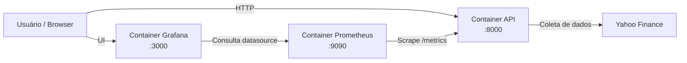

# Tech Challenge 04 - API de Previsão de Ações com LSTM

## O que este projeto faz

Esta API treina um modelo LSTM com histórico de preços (Yahoo Finance) para prever o próximo preço de fechamento de uma ação.  
Além disso, expõe endpoints de saúde e métricas básicas da aplicação.

## Dependências do projeto

Dependências principais (via Poetry):

- `fastapi[standard]`
- `uvicorn[standard]`
- `pydantic-settings`
- `numpy`
- `pandas`
- `yfinance`
- `scikit-learn`
- `tensorflow`
- `joblib`
- `psutil`

## Passo a passo para executar o projeto

### 1) Instalar Python 3.12 com pyenv

```bash
pyenv install 3.12.13
pyenv local 3.12.13
```

### 2) Instalar Poetry

```bash
pip install poetry
```

### 3) Configurar o ambiente virtual com Python 3.12

```bash
poetry env use $(pyenv which python)
```

### 4) Instalar dependências

```bash
poetry install --no-root
```

### 5) Subir a API

```bash
poetry run fastapi run app/main.py --reload
```

### 6) Acessar

- API: `http://localhost:8000`
- Swagger: `http://localhost:8000/docs`

### API em producao

| Recurso | URL |
|---|---|
| Swagger (docs) | https://tech-challenge-04-kwby.onrender.com/docs |
| Health Check | https://tech-challenge-04-kwby.onrender.com/api/v1/health/ |

## Execução com Docker Compose (API + Prometheus + Grafana)

### Subir os serviços

```bash
docker compose up -d --build
```

### Verificar status

```bash
docker compose ps
```

### Derrubar os serviços

```bash
docker compose down
```

### Acessos dos serviços

| Serviço | URL | Observação |
|---|---|---|
| API FastAPI | `http://localhost:8000` | Endpoints da aplicação |
| Swagger | `http://localhost:8000/docs` | Teste interativo das rotas |
| Métricas Prometheus da API | `http://localhost:8000/metrics` | Exposição de métricas da API |
| Prometheus UI | `http://localhost:9090` | Consulta de métricas e targets |
| Grafana | `http://localhost:3000` | Visualização dos dashboards |

### Credenciais do Grafana

- Usuário: `admin`
- Senha: `admin`

### Provisionamento automático no startup

- Datasource Prometheus: `ops/grafana/provisioning/datasources/datasource.yml`
- Dashboards provisionados: `ops/grafana/provisioning/dashboards/`
- Configuração de scrape do Prometheus: `ops/prometheus/prometheus.yml`

### Reaplicar alterações de provisioning (Grafana)

```bash
docker compose up -d --force-recreate grafana
```

### Diagrama de comunicação entre containers



## Arquitetura do projeto

```text
app/
  controllers/   # Camada HTTP: rotas e códigos de resposta
  services/      # Regras de negócio: treino, inferência, métricas
  dtos/          # Contratos de entrada/saída (validação Pydantic)
  core/          # Configuração da aplicação e registro de rotas
  data/          # Artefatos persistidos (modelo, scaler, metadados)
```

### Responsabilidades por módulo

- `app/main.py`: inicializa FastAPI e middleware de métricas por requisição.
- `app/core/settings.py`: configurações globais (prefixo, defaults de treino, pasta de artefatos).
- `app/core/routers.py`: centraliza o registro dos controllers.
- `app/controllers/health_check.py`: endpoints de disponibilidade e monitoramento.
- `app/controllers/machine_learning.py`: endpoints de treino, predição e métricas do modelo.
- `app/services/health_service.py`: cálculo/retorno de métricas de infraestrutura da API.
- `app/services/ml_service.py`: pipeline completa de ML (coleta, preparo, treino, avaliação, persistência e inferência).
- `app/dtos/ml.py`: schemas de request/response e validações de campos.

## Endpoints e como usar

Prefixo base: `/api/v1`

| Método | Rota | Descrição |
|---|---|---|
| GET | `/health/` | Verifica se a API está disponível. |
| GET | `/health/metrics` | Retorna métricas de execução da API. |
| POST | `/ml/train` | Treina e salva o modelo LSTM. |
| GET | `/ml/metrics` | Retorna métricas do último treino. |
| POST | `/ml/predict` | Prediz o próximo fechamento com base em preços recentes. |

---

### GET `/api/v1/health/`

**Uso**
```bash
curl -X GET "http://localhost:8000/api/v1/health/"
```

**Resposta**
```json
{ "status": "ok" }
```

### GET `/api/v1/health/metrics`

**Uso**
```bash
curl -X GET "http://localhost:8000/api/v1/health/metrics"
```

**Campos de resposta**

| Campo | Tipo | Descrição |
|---|---|---|
| `total_requests` | `int` | Total de requisições processadas desde a subida da API. |
| `average_latency_ms` | `float` | Latência média das requisições em milissegundos. |
| `cpu_percent` | `float` | Uso atual de CPU da máquina. |
| `memory_percent` | `float` | Uso atual de memória da máquina. |
| `process_memory_mb` | `float` | Memória consumida pelo processo da API (MB). |

### POST `/api/v1/ml/train`

Treina o modelo LSTM e salva artefatos em `app/data`.

**Body (JSON)**
```json
{
  "ticker": "DIS",
  "start_date": "2022-01-01",
  "end_date": "2023-12-31",
  "lookback_window_size": 20,
  "training_data_ratio": 0.8,
  "training_epochs": 20,
  "samples_per_batch": 32,
  "lstm_hidden_units": 50,
  "learning_rate": 0.001
}
```

**Descrição dos campos**

| Campo | Tipo | Descrição |
|---|---|---|
| `ticker` | `string` | Código da ação (ex.: `DIS`, `AAPL`, `PETR4.SA`). |
| `start_date` | `string` | Data inicial para coleta (`YYYY-MM-DD`). |
| `end_date` | `string \| null` | Data final para coleta (`YYYY-MM-DD`). `null` usa data atual. |
| `lookback_window_size` | `int` | Quantidade de fechamentos anteriores usada como entrada da LSTM. |
| `training_data_ratio` | `float` | Percentual de dados para treino (restante é validação). |
| `training_epochs` | `int` | Número de épocas de treinamento. |
| `samples_per_batch` | `int` | Quantidade de amostras por lote durante o treino. |
| `lstm_hidden_units` | `int` | Quantidade de unidades (neurônios) da camada LSTM. |
| `learning_rate` | `float` | Taxa de aprendizado do otimizador. |

**Uso**
```bash
curl -X POST "http://localhost:8000/api/v1/ml/train" \
  -H "Content-Type: application/json" \
  -d '{
    "ticker": "DIS",
    "start_date": "2022-01-01",
    "end_date": "2023-12-31",
    "lookback_window_size": 20,
    "training_data_ratio": 0.8,
    "training_epochs": 20,
    "samples_per_batch": 32,
    "lstm_hidden_units": 50,
    "learning_rate": 0.001
  }'
```

### GET `/api/v1/ml/metrics`

Retorna métricas do último treinamento realizado.

**Uso**
```bash
curl -X GET "http://localhost:8000/api/v1/ml/metrics"
```

**Campos de resposta**

| Campo | Tipo | Descrição |
|---|---|---|
| `ticker` | `string` | Ticker usado no treino. |
| `start_date` | `string` | Data inicial usada no treino. |
| `end_date` | `string \| null` | Data final usada no treino. |
| `lookback_window_size` | `int` | Janela temporal usada no treino. |
| `mae` | `float` | Erro absoluto médio (Mean Absolute Error). |
| `rmse` | `float` | Raiz do erro quadrático médio (Root Mean Squared Error). |
| `mape` | `float` | Erro percentual absoluto médio (Mean Absolute Percentage Error). |
| `trained_at` | `string` | Data/hora do treino (ISO 8601). |
| `validation_samples` | `int` | Quantidade de amostras usadas na validação. |

### POST `/api/v1/ml/predict`

Prediz o próximo fechamento com base em uma sequência recente de fechamentos.

**Body (JSON)**
```json
{
  "recent_closing_prices": [
    96.3, 96.7, 97.1, 97.0, 97.6,
    98.0, 97.9, 98.3, 98.7, 99.1,
    99.4, 99.8, 100.1, 100.4, 100.8,
    101.0, 101.3, 101.7, 102.1, 102.5
  ]
}
```

**Descrição dos campos**

| Campo | Tipo | Descrição |
|---|---|---|
| `recent_closing_prices` | `list[float]` | Lista de fechamentos recentes. Deve ter exatamente o tamanho de `lookback_window_size` do último treino. |

**Uso**
```bash
curl -X POST "http://localhost:8000/api/v1/ml/predict" \
  -H "Content-Type: application/json" \
  -d '{
    "recent_closing_prices": [
      96.3, 96.7, 97.1, 97.0, 97.6,
      98.0, 97.9, 98.3, 98.7, 99.1,
      99.4, 99.8, 100.1, 100.4, 100.8,
      101.0, 101.3, 101.7, 102.1, 102.5
    ]
  }'
```

**Campos de resposta**

| Campo | Tipo | Descrição |
|---|---|---|
| `predicted_close` | `float` | Próximo preço de fechamento previsto pelo modelo. |
| `ticker` | `string` | Ticker do modelo treinado em uso. |
| `lookback_window_size` | `int` | Janela esperada pelo modelo para inferência. |
